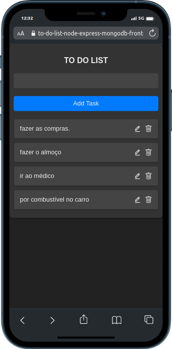
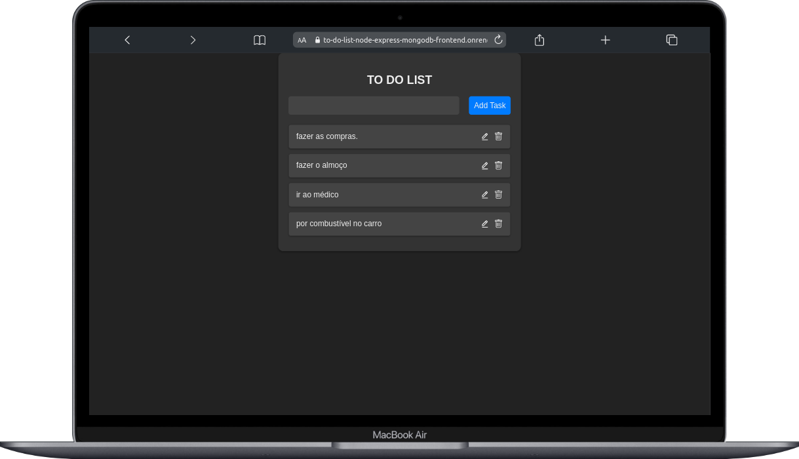

# TO-DO-LIST-NODE-EXPRESS-MONGODB

O projeto é uma lista de tarefas onde o usuário pode visualizar, incluir, editar e deletar tarefas a sua lista, ou seja, contemplando o CRUD.
O CRUD é um acrônimo comumente utilizado na área de desenvolvimento de software e refere-se às quatro operações básicas que podem ser realizadas em um banco de dados ou sistema persistente de armazenamento de informações. Cada letra do acrônimo representa uma operação específica:

1.  Create (Criação): A operação "C" é utilizada para inserir novos registros ou entidades no banco de dados. É a ação de criar novos dados.

2.  Read (Leitura): A operação "R" é usada para recuperar ou ler informações existentes no banco de dados. Permite acessar os dados previamente armazenados.

3.  Update (Atualização): A operação "U" permite modificar ou atualizar dados já existentes no banco de dados.

4.  Delete (Exclusão): A operação "D" é utilizada para remover registros ou entidades do banco de dados.

O CRUD é uma base fundamental para o desenvolvimento de aplicações que interagem com banco de dados, e essas operações são aplicadas em conjunto para manipular as informações armazenadas. As operações são comuns em diversas tecnologias e ambientes, como aplicativos web, aplicativos móveis, sistemas de gerenciamento empresarial, entre outros. Com o CRUD, é possível realizar as principais funcionalidades de uma aplicação, permitindo aos usuários criar, ler, atualizar e excluir dados conforme necessário.

O banco de dados utilizados é o MongoDB, para tal fora criado o banco usando a plataforma [Atlas MongoDB](https://www.mongodb.com/atlas/database). O MongoDB é amplamente utilizado em cenários como aplicativos web, aplicativos móveis, Internet das Coisas (IoT) e outras aplicações que requerem armazenamento e recuperação de dados de forma rápida e flexível. Sua abordagem NoSQL oferece uma alternativa poderosa aos bancos de dados relacionais tradicionais, especialmente quando a estrutura dos dados é menos previsível ou quando a escalabilidade é uma prioridade.

Para o frontend fora utilizado o React que é uma biblioteca JavaScript de código aberto desenvolvida pelo Facebook para construção de interfaces de usuário interativas e reativas. Ele permite aos desenvolvedores criar componentes reutilizáveis que representam partes específicas da interface do usuário, os quais são atualizados automaticamente quando ocorrem mudanças nos dados. O React utiliza uma abordagem baseada em componentes, tornando-o eficiente e fácil de manter. Além disso, o React é frequentemente usado em conjunto com outras bibliotecas e ferramentas, como o ReactDOM para renderização no navegador, o React Native para desenvolvimento de aplicativos móveis, e várias outras bibliotecas de suporte para ajudar no desenvolvimento de aplicações robustas e de alto desempenho. Por causa de sua popularidade e grande comunidade de desenvolvedores, o React tornou-se uma escolha amplamente adotada para a construção de interfaces modernas e responsivas em aplicações web e móveis.

### __Demonstração__

<center>
<div style="background-color: white; display: inline-block; padding: 10px;">
  
  
</div>
</center>

- [___Veja o projeto em ação!___](https://to-do-list-node-express-mongodb-frontend.onrender.com/) 🎬

> Para o deploy do backend e frontend fora utilizado o [Render](https://render.com/)


## Backend

### Configurações

Certifique-se de criar um arquivo `.env` na pasta `backend` com as seguintes variáveis de ambiente:
```
MONGO_URL=<URL_do_banco_de_dados_MongoDB>
```

### Instalação e Execução

Para executar o backend, siga os passos abaixo:

1. Na pasta `backend`, instale as dependências do projeto com o seguinte comando:
```
npm install
```
2. Para iniciar o servidor de desenvolvimento, utilize o seguinte comando:
```
npm run dev
```

Isso iniciará o servidor usando o `nodemon`, que permitirá que o servidor reinicie automaticamente sempre que você fizer alterações no código.

## Frontend

### Configurações

Certifique-se de criar um arquivo `.env` na pasta `frontend` com as seguintes variáveis de ambiente:
```
REACT_APP_API_URL=<URL_do_backend>
```

Substitua `<URL_do_backend>` pela URL onde o backend está hospedado. Por exemplo, se o backend estiver sendo executado localmente, a URL pode ser `http://localhost:5000`.

### Instalação e Execução

Para executar o frontend, siga os passos abaixo:

1. Na pasta `frontend`, instale as dependências do projeto com o seguinte comando:
```
npm install
```


2. Para iniciar o servidor de desenvolvimento, utilize o seguinte comando:
```
npm start
```

Isso iniciará o aplicativo React em modo de desenvolvimento e abrirá automaticamente no seu navegador padrão.

## Banco de Dados MongoDB

Este projeto utiliza o banco de dados MongoDB para armazenar os dados. Certifique-se de ter criado um banco de dados no MongoDB e obtenha a URL de conexão para configurar a variável de ambiente `MONGO_URL` no backend.

## Pacotes Instalados

O projeto utiliza os seguintes pacotes npm:

- Backend:
  - cors: "^2.8.5"
  - dotenv: "^16.3.1"
  - express: "^4.18.2"
  - mongoose: "^7.4.1"
  - nodemon: "^3.0.1"

- Frontend:
  - @testing-library/jest-dom: "^5.17.0"
  - @testing-library/react: "^13.4.0"
  - @testing-library/user-event: "^13.5.0"
  - axios: "^1.4.0"
  - react: "^18.2.0"
  - react-dom: "^18.2.0"
  - react-icons: "^4.10.1"
  - react-scripts: "5.0.1"
  - web-vitals: "^2.1.4"

## Observações

Certifique-se de que o backend esteja em execução antes de iniciar o frontend, pois o frontend depende das APIs fornecidas pelo backend para funcionar corretamente.

Lembre-se também de atualizar as URLs das variáveis de ambiente de acordo com o ambiente em que o projeto está sendo executado (desenvolvimento, produção, etc.).

### __Contato__
Se tiver alguma dúvida ou sugestão, sinta-se à vontade para entrar em contato comigo:

E-mail: <ric.kds@hotmail.com>

GitHub: [github.com/ricardokuhlkamp](https://github.com/ricardokuhlkamp)

Linkedin: [www.linkedin.com/in/ricardo-kühlkamp-dev](www.linkedin.com/in/ricardo-kühlkamp-dev)